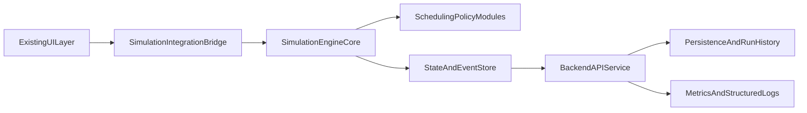

# Readers-Writers Remaining Backend + Project Completion Plan

## Context Anchors
- Prior conversation reference: [UI UX Build Plan Execution](8254253a-359a-4923-be76-49ac83ecb233)
- Existing UI/UX scope to preserve and not duplicate: [`/Users/abhishek/.cursor/plans/readers_writers_ui_ux_build_plan_bff432c7.plan.md`](/Users/abhishek/.cursor/plans/readers_writers_ui_ux_build_plan_bff432c7.plan.md)

## Goal
Finish the full Readers-Writers project by implementing all non-UI layers: simulation core, policy logic, backend services/APIs, state integration, validation tooling, and final handoff artifacts, while keeping all UI components from the existing UI/UX plan intact.

## Explicit Boundaries
- Keep unchanged: all UI/UX components and visual behavior already defined in the UI/UX plan.
- Implement now: logic engine, scheduling policies, backend endpoints/services, persistence/logging model, integration contracts, tests, and project completion docs.

## Target Deliverables
- Deterministic simulation engine that advances state per tick.
- Pluggable scheduling policies: `readerPriority`, `writerPriority`, `fair`.
- Backend/API contract for scenario config, run control, snapshots, and logs.
- UI integration adapters that feed existing components without redesigning them.
- Comprehensive tests (unit + integration + regression for starvation/fairness invariants).
- Final project handoff file for execution, validation, and deployment readiness.

## Implementation Architecture

## Phase 1 - Domain and Engine Foundation
- Create/confirm canonical domain models in [`/Users/abhishek/Documents/GitHub/MiniProject-OS/engine/types.ts`](/Users/abhishek/Documents/GitHub/MiniProject-OS/engine/types.ts):
  - Thread, role (reader/writer), lifecycle state, queue entry, lock status, event log, simulation config.
- Implement pure transition kernel in [`/Users/abhishek/Documents/GitHub/MiniProject-OS/engine/simulationEngine.ts`](/Users/abhishek/Documents/GitHub/MiniProject-OS/engine/simulationEngine.ts):
  - `initializeSimulation(config)`
  - `advanceSimulation(state, policy, tickDelta)`
  - `deriveStats(state)`
- Add deterministic RNG seed support for reproducible runs.

## Phase 2 - Scheduling Policies
- Add policy modules in [`/Users/abhishek/Documents/GitHub/MiniProject-OS/engine/policies/`](/Users/abhishek/Documents/GitHub/MiniProject-OS/engine/policies/):
  - `readerPriority.ts`
  - `writerPriority.ts`
  - `fair.ts`
- Define shared policy interface and selection dispatcher in [`/Users/abhishek/Documents/GitHub/MiniProject-OS/engine/policies/index.ts`](/Users/abhishek/Documents/GitHub/MiniProject-OS/engine/policies/index.ts).
- Encode invariants:
  - Never allow writer with active readers.
  - Never allow concurrent writers.
  - Fair mode must prevent indefinite starvation.

## Phase 3 - Backend/API Layer
- Implement APIs in [`/Users/abhishek/Documents/GitHub/MiniProject-OS/app/api/`](/Users/abhishek/Documents/GitHub/MiniProject-OS/app/api/) (or framework-equivalent backend folder if stack differs):
  - `POST /api/simulation/init`
  - `POST /api/simulation/step`
  - `POST /api/simulation/run`
  - `POST /api/simulation/reset`
  - `GET /api/simulation/:id/snapshot`
  - `GET /api/simulation/:id/logs`
- Add schema validation for all payloads and responses.
- Add backend-side guardrails for malformed transitions and invalid policy names.

## Phase 4 - State Persistence and Run History
- Add lightweight persistence layer in [`/Users/abhishek/Documents/GitHub/MiniProject-OS/lib/persistence/`](/Users/abhishek/Documents/GitHub/MiniProject-OS/lib/persistence/):
  - In-memory store initially; optional file-backed JSON for replay/debug.
- Persist run metadata: config, seed, policy, start/end timestamps, terminal reason.
- Persist event stream for timeline replay and post-run analysis.

## Phase 5 - UI Integration (No Redesign)
- Wire existing UI components through a stable bridge in [`/Users/abhishek/Documents/GitHub/MiniProject-OS/context/SimulationContext.tsx`](/Users/abhishek/Documents/GitHub/MiniProject-OS/context/SimulationContext.tsx) or equivalent store:
  - Map backend snapshots to UI view models.
  - Connect controls to API commands without changing visual structure.
- Keep UI component interfaces stable; only add props needed for real data binding.

## Phase 6 - Testing and Quality Gates
- Unit tests in [`/Users/abhishek/Documents/GitHub/MiniProject-OS/tests/engine/`](/Users/abhishek/Documents/GitHub/MiniProject-OS/tests/engine/):
  - State transition correctness.
  - Policy-specific scheduling behavior.
  - Invariant enforcement.
- Integration tests in [`/Users/abhishek/Documents/GitHub/MiniProject-OS/tests/api/`](/Users/abhishek/Documents/GitHub/MiniProject-OS/tests/api/):
  - Endpoint contracts, validation failures, lifecycle commands.
- Regression scenarios:
  - High reader load, high writer load, alternating arrivals, fairness under long runs.

## Phase 7 - Finalization and Handoff
- Update [`/Users/abhishek/Documents/GitHub/MiniProject-OS/README.md`](/Users/abhishek/Documents/GitHub/MiniProject-OS/README.md) with:
  - Architecture overview.
  - API contract examples.
  - Test and run instructions.
  - Known limitations and extension points.
- Maintain/update a single root-level mistakes log file (per your rule) with solved issues and safeguards for next agents.
- Produce final completion checklist file in project root:
  - [`/Users/abhishek/Documents/GitHub/MiniProject-OS/PROJECT_FINISH_CHECKLIST.md`](/Users/abhishek/Documents/GitHub/MiniProject-OS/PROJECT_FINISH_CHECKLIST.md)
  - Includes done criteria for engine, APIs, integration, tests, and release readiness.

## Done Criteria
- Engine produces deterministic, valid transitions across all supported policies.
- Backend API supports full run lifecycle and validated contracts.
- Existing UI surfaces live simulation data without UI redesign.
- Tests pass for invariants, starvation/fairness behavior, and API contracts.
- README and final checklist enable another agent/developer to run, verify, and ship.
