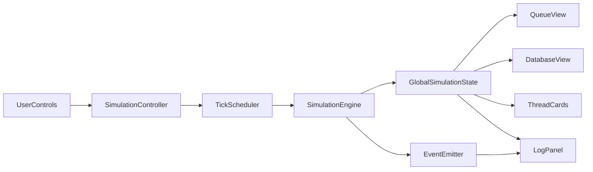

# Readers-Writers Web Simulator Build Plan

## 1) Project Overview

### Objective
Build an educational, interactive web application that demonstrates the Readers-Writers synchronization problem by simulating concurrent reader/writer threads, visualizing scheduling decisions in real time, and animating state transitions to make OS concepts intuitive.

### Key Features
- Configurable simulation of Reader and Writer threads with random/manual arrivals.
- Three scheduling modes:
  - Reader-priority
  - Writer-priority
  - Fair scheduling (FIFO/no starvation)
- Real-time visualization of:
  - Active readers
  - Active writer lock
  - Waiting queue
  - Database access state
- Controls: start, pause, step, reset, speed slider, mode switch.
- Event log timeline with filtering and timestamps.
- Smooth animations for transitions (arrive, queue, execute, complete, blocked).

## 2) Tech Stack Recommendation

### Frontend
- Framework: Next.js (App Router) + React + TypeScript.
  - Why: component structure, easy deployment, strong DX, scalable architecture.
- Styling: Tailwind CSS.
  - Why: fast UI iteration, consistent design tokens, responsive layout.
- Animation: Framer Motion.
  - Why: declarative animations, layout transitions, shared element support.

### Optional Backend
- Default: fully frontend simulation (recommended for v1).
  - Simulation is deterministic and local; no backend required.
- Optional Node.js API (future):
  - Persist simulation sessions/logs.
  - Share/replay scenario IDs.

### State Management
- Core simulation state: `useReducer` + dedicated simulation engine module.
- App UI settings and controls: React context (`SimulationContext`).
- Optional future upgrade: Zustand if state becomes large or needs cross-feature persistence.

## 3) System Architecture

### High-Level Architecture (Text)
- Presentation layer: dashboard components render thread cards, queue, database state, controls, and logs.
- Simulation engine layer: pure logic/state transitions per scheduler mode.
- Orchestration layer: timer loop dispatches ticks/events to engine.
- Animation layer: UI reacts to state transitions and animates movement/status changes.

### Data Flow
1. User changes controls (mode/speed/start).
2. Controller updates runtime config.
3. Tick scheduler triggers simulation step.
4. Engine computes next state using selected policy.
5. UI components read derived slices and re-render.
6. Event entries are appended to log store and displayed.

### Simulation Engine Design
- Deterministic, pure functions where possible:
  - `advanceSimulation(state, config, now)`
  - `admitThreads(...)`, `acquireAccess(...)`, `releaseAccess(...)`
- Time model:
  - Discrete ticks (e.g., 100ms base), scaled by speed multiplier.
- Separation:
  - `engine/algorithms/*` for scheduling policy logic.
  - `engine/reducers/*` for state transitions.

## 4) Component Breakdown

### `SimulationPage`
- Responsibility: overall layout composition.
- Props: none (top-level page).
- State: none; pulls from context.

### `ControlPanel`
- Responsibility: start/pause/reset/step, mode select, speed control, add-thread actions.
- Props:
  - `isRunning`, `speed`, `mode`, callbacks for controls.
- Local state:
  - form inputs for manual thread spawn (type, duration).

### `ThreadList` / `ThreadCard`
- Responsibility: render each thread and lifecycle status.
- Props:
  - thread model (`id`, `type`, `state`, `remainingTime`, `arrivalTick`).
- Local state: transient UI hover/tooltip.

### `DatabaseView`
- Responsibility: visualize shared resource lock state.
- Props:
  - `activeReaders`, `activeWriterId`, `isWriting`.
- Local state: none.

### `QueueView`
- Responsibility: show waiting queue order and blocked reason.
- Props:
  - `waitingQueue`, `mode`, `blockedBy` metadata.
- Local state: none.

### `LogPanel`
- Responsibility: timeline of events with optional filters.
- Props:
  - `logs`, `filters`, `onFilterChange`.
- Local state: collapsed/expanded sections.

### `StatsPanel`
- Responsibility: display throughput/wait times/starvation indicators.
- Props:
  - metrics derived from engine state.
- Local state: none.

### `SimulationController` (non-visual)
- Responsibility: timer orchestration and dispatching ticks.
- Props:
  - dispatcher and current config.
- State:
  - interval handle, paused/running clock refs.

### `SimulationEngine` (module)
- Responsibility: core synchronization logic and transition rules.
- Inputs:
  - current state + config + tick.
- Output:
  - next state + emitted events.

## 5) Data Model & State Design

### Core Types
- `ThreadType = 'reader' | 'writer'`
- `ThreadState = 'arriving' | 'waiting' | 'blocked' | 'reading' | 'writing' | 'completed'`

### Thread Model
- `id: string`
- `type: ThreadType`
- `state: ThreadState`
- `arrivalTick: number`
- `serviceTime: number` (total required)
- `remainingTime: number`
- `startTick?: number`
- `endTick?: number`
- `waitReason?: 'writerActive' | 'readersActive' | 'writerQueued' | 'fairTurn'`

### Simulation State
- `tick: number`
- `isRunning: boolean`
- `mode: 'readerPriority' | 'writerPriority' | 'fair'`
- `speedMultiplier: number`
- `threads: Record<string, Thread>`
- `arrivalQueue: string[]` (future arrivals)
- `waitingQueue: string[]`
- `activeReaders: string[]`
- `activeWriterId: string | null`
- `isWriting: boolean`
- `logEntries: LogEntry[]`
- `metrics: { averageWaitReader, averageWaitWriter, completedReaders, completedWriters, starvationWarnings }`

### Derived State
- `canAdmitReader`
- `canAdmitWriter`
- `writerWaitingCount`
- `readerWaitingCount`

## 6) Core Algorithm Design

### Shared Rules
- Multiple readers can read simultaneously.
- Writer requires exclusive access (no readers/writers active).
- On each tick:
  - process arrivals,
  - attempt admissions per policy,
  - decrement remaining times for active threads,
  - release completed threads,
  - append events.

### A) Reader-Priority
- Readers admitted whenever no active writer.
- Writers wait until all active readers finish.
- Risk: writer starvation if readers continuously arrive.
- Implementation details:
  - admit all eligible readers before considering writers.

### B) Writer-Priority
- If any writer waiting, block new readers.
- Active readers finish naturally; then next writer gets lock.
- Reduces writer starvation, may increase reader wait.
- Implementation details:
  - `canAdmitReader = !isWriting && waitingWriters===0`.

### C) Fair Scheduling (No Starvation)
- Use FIFO queue with strict admission order semantics.
- Batch consecutive readers at queue head if no writer active.
- Writer at head gets exclusive turn.
- Guarantees eventual progress for both categories.
- Implementation details:
  - maintain `waitingQueue` as canonical order.
  - admission checks head(s) only.

### Concurrency Simulation via Timers
- Use discrete simulation ticks, not real OS threads.
- Interval loop drives deterministic transitions:
  - `effectiveTickDuration = baseDuration / speedMultiplier`.
- Step mode executes a single `advanceSimulation` call.

## 7) Simulation Flow

1. Thread generated (manual/random) with arrival tick and service time.
2. At arrival tick, state changes `arriving -> waiting`, pushed to queue.
3. Scheduler evaluates policy and active lock conditions.
4. If admitted:
   - Reader: `waiting/blocked -> reading`, added to `activeReaders`.
   - Writer: `waiting/blocked -> writing`, set `activeWriterId`.
5. Active threads consume time each tick (`remainingTime--`).
6. On `remainingTime === 0`, state becomes `completed`, lock released.
7. Scheduler reevaluates queue for next admissions.
8. All transitions are logged and animated.

Event lifecycle:
- `arrival -> waiting -> (blocked optional) -> reading/writing -> completed`

## 8) UI/UX Design Plan

### Dashboard Layout
- Top: `ControlPanel` + mode/speed/status.
- Middle-left: `QueueView` (waiting lane).
- Middle-center: `DatabaseView` (shared resource lock visualization).
- Middle-right: `ThreadList` (all thread cards by status groups).
- Bottom: `LogPanel` + `StatsPanel`.

### Visual Representation
- Reader: blue card/icon.
- Writer: amber/red card/icon.
- Database node changes state:
  - Idle (gray)
  - Reading (blue glow + reader count)
  - Writing (red pulse + writer ID)

### Color Coding for States
- Arriving: neutral slate
- Waiting: yellow
- Blocked: orange
- Reading: blue
- Writing: red
- Completed: green/faded

### Queue Visualization
- Horizontal or vertical timeline with ordered slots.
- Show queue position index.
- Block reason badge on each waiting item.

## 9) Animation Plan

### Thread Movement
- Framer Motion layout transitions for:
  - spawn at source area,
  - move to queue lane,
  - move into database area,
  - move to completed zone.

### Blocking and Waiting Cues
- Blocked threads:
  - subtle shake/pause animation + badge.
- Waiting threads:
  - low-intensity pulsing opacity.

### Access State Animations
- Database lock:
  - writer lock pulse (strong).
  - reader lock glow (soft, count badge animates).

### Transition Strategy
- Use stable IDs and `AnimatePresence` to avoid flicker.
- Keep timing proportional to simulation speed (decouple logic tick from animation duration with clamp bounds).

## 10) Control Features

- Start: begins interval loop.
- Pause: freezes tick progression, preserves state.
- Reset: restores initial state and clears logs.
- Step: advances one tick for teaching/debug mode.
- Speed control: 0.5x, 1x, 2x, 4x.
- Mode selection: reader-priority / writer-priority / fair.
- Thread injection controls:
  - Add reader/writer manually.
  - Optional burst generation presets.

## 11) Logging System

### Events to Track
- Thread created
- Thread arrived
- Thread queued
- Thread blocked (with reason)
- Thread admitted to read/write
- Thread completed
- Policy/mode changed
- Simulation started/paused/reset

### Log Display
- Reverse chronological timeline.
- Each entry includes:
  - tick/time,
  - event type,
  - thread ID/type,
  - short message.
- Filter chips: `system`, `reader`, `writer`, `warning`.
- Optional export JSON button (future enhancement).

## 12) Folder Structure (Scalable)

- [app/page.tsx](app/page.tsx) - main route entry.
- [app/layout.tsx](app/layout.tsx) - app shell.
- [components/simulation/ControlPanel.tsx](components/simulation/ControlPanel.tsx)
- [components/simulation/DatabaseView.tsx](components/simulation/DatabaseView.tsx)
- [components/simulation/QueueView.tsx](components/simulation/QueueView.tsx)
- [components/simulation/ThreadCard.tsx](components/simulation/ThreadCard.tsx)
- [components/simulation/ThreadList.tsx](components/simulation/ThreadList.tsx)
- [components/simulation/LogPanel.tsx](components/simulation/LogPanel.tsx)
- [components/simulation/StatsPanel.tsx](components/simulation/StatsPanel.tsx)
- [context/SimulationContext.tsx](context/SimulationContext.tsx)
- [engine/simulationEngine.ts](engine/simulationEngine.ts)
- [engine/policies/readerPriority.ts](engine/policies/readerPriority.ts)
- [engine/policies/writerPriority.ts](engine/policies/writerPriority.ts)
- [engine/policies/fairPolicy.ts](engine/policies/fairPolicy.ts)
- [engine/types.ts](engine/types.ts)
- [engine/metrics.ts](engine/metrics.ts)
- [utils/time.ts](utils/time.ts)
- [utils/id.ts](utils/id.ts)
- [styles/globals.css](styles/globals.css)

## 13) Step-by-Step Development Roadmap

### Phase 1 - Project Setup
- Initialize Next.js + TypeScript + Tailwind + Framer Motion.
- Set up base layout and theme tokens.
- Define domain types in `engine/types.ts`.

### Phase 2 - Static UI Scaffolding
- Build dashboard layout and placeholder components.
- Add color/state legends and empty-state visuals.
- Ensure responsive layout works for desktop/laptop.

### Phase 3 - Core State + Engine Foundation
- Implement reducer and context provider.
- Build tick scheduler (`start/pause/step/reset`).
- Implement generic thread lifecycle transitions and logging.

### Phase 4 - Scheduling Policies
- Implement reader-priority policy logic.
- Implement writer-priority policy logic.
- Implement fair FIFO policy with starvation prevention.
- Add mode switching and runtime policy application.

### Phase 5 - Dynamic UI Binding
- Bind component views to live state slices.
- Show activeReaders, writer lock, waiting queue order.
- Add stats calculations and display.

### Phase 6 - Animations
- Add thread movement animations and queue/database transitions.
- Add blocked/waiting/active visual cues.
- Tune animation timing across speed multipliers.

### Phase 7 - Robustness and Polish
- Handle edge cases: rapid reset, mode change mid-run, large queue.
- Improve accessibility (labels, contrast, keyboard controls).
- Add tooltips/educational notes explaining scheduler behavior.

### Phase 8 - Final QA and Demo Packaging
- Validate correctness against expected scheduling outcomes.
- Prepare scripted demo scenarios.
- Add README walkthrough and screenshots/GIF.

## 14) Testing & Demo Plan

### Correctness Verification
- Unit tests for each policy:
  - reader-priority admits readers when no writer active.
  - writer-priority blocks new readers if writer waits.
  - fair policy preserves FIFO progression.
- Engine transition tests:
  - arrival, block/unblock, completion, lock release.
- Metric tests:
  - wait times and completion counters are accurate.

### UI/Interaction Tests
- Component tests for control actions and state rendering.
- Integration tests for start/pause/reset and speed behavior.
- Snapshot/visual checks for queue and database states.

### Demo Scenarios
- Scenario A: multiple readers concurrently read.
- Scenario B: writer arrives and blocks until readers finish.
- Scenario C: continuous readers causing writer starvation in reader-priority.
- Scenario D: writer-priority reducing writer wait but delaying readers.
- Scenario E: fair mode alternating progress without starvation.

## Implementation Notes for Cursor Execution
- Implement in strict phase order; avoid animating before policy correctness is verified.
- Use deterministic seeded random arrivals for reproducible demos/tests.
- Keep engine pure and UI-agnostic so algorithm behavior can be tested independently of React.
